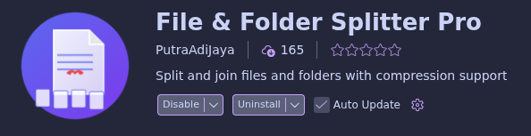

# Minecraft_Cobblemon_Guide
Un guide pour installer Cacademy aussi fidèlement que possible à PokeRayou saison 2.

> Github limite la taille des fichiers à 100MB. Certains fichiers dans ce repo sont trop gros donc ils sont divisé en plusieurs partis de 100MB.
> Pour re-fusionner des fichiers divisés il vous faut installer [VSCode](https://code.visualstudio.com/) (mais je recommande plutôt [VSCodium](https://vscodium.com/)) ainsi que le plugin gratuit "File & Folder Splitter Pro".
> Faites un click droit sur un des fichiers divisé et cliquez sur "Join Split Files". Je donne, plus bas, une liste exhaustive de fichiers divisés pour que vous puissiez les fusionner sans devoir les chercher manuellement.
> 

## Fichiers divisés

```yaml
Aucun
```
Note: Si vous êtes, comme moi, sur [PrismLauncher](https://prismlauncher.org/) alors vous devrez désactiver le mod "Moonrise" (c'est un mod d'optimisation qui pose problème sur Prism)

## Tutoriel - Par Eligos

### Quelques précisions avant de commencer

Lorsque le tuto indique un chemin de dossier, par exemple :
```bash
C:\Users\"user"\curseforge\minecraft\Instances\Cacademy - The Ultimate Cobblemon Academy\config\cobbleride
```
👉 "user" est à remplacer par le nom de votre compte.

Si vous vous appelez Timothée, cela donnera :
```bash
C:\Users\Timothée\curseforge\minecraft\Instances\Cacademy - The Ultimate Cobblemon Academy\config\cobbleride
```

Ces chemins sont pour une installation Windows, si vous êtes sur Linux vous devrez adapter accordémment.
Ces chemins sont pour CurseForge, il vous suffira de remplacer pour Modrinth ou Prism ou tout autre laucher si vous n'utilisez pas CurseForge.

Les mods sont à installer côté client et côté serveur, sauf indication contraire.
⚠️ Pour rappel, le modpack est conçu pour être joué sur serveur.
Vous pouvez jouer en self-host, mais ce ne sera pas optimal.
Pour plus d’informations, rendez-vous sur le Discord.

## Thanks

BIG THANKS to 👑RoiCheese
> Allez voir ses réseaux sociaux : [Youtube](https://www.youtube.com/@RoiCheese), [Twitch](https://www.twitch.tv/roicheese), [Discord](https://discord.gg/fYmPwMBjdB), et si vous le pouvez et vous sentez généreux vous pouvez aussi le soutenir sur [Paypal](https://www.paypal.com/paypalme/che3sepay).

Je voudrais aussi spécialement recmercier les membres des discords :
- Eligos - Qui, encore une fois, à créer ce tuto de A à Z.
- Octoj - Which we had conversation, with Eligos, about the modpack.
- All other person of the "Cacademy" and "Cobblemon Academy" Discord servers.
